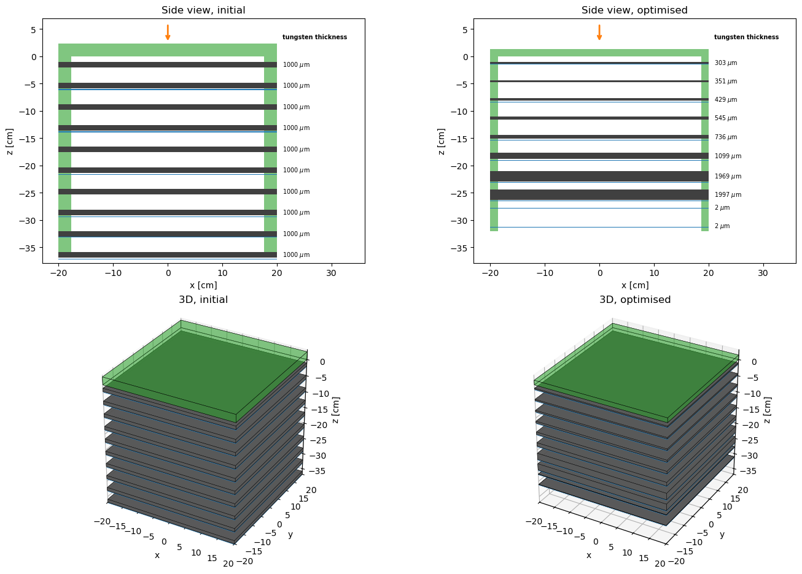
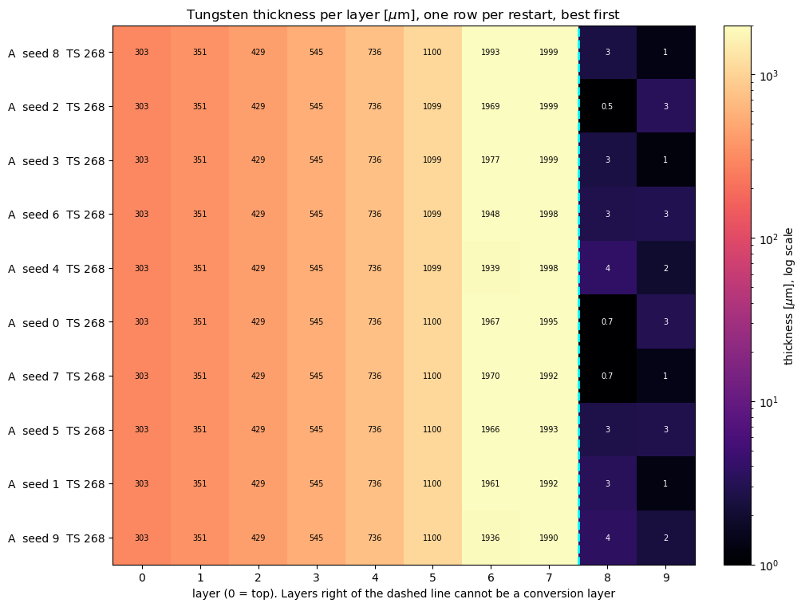
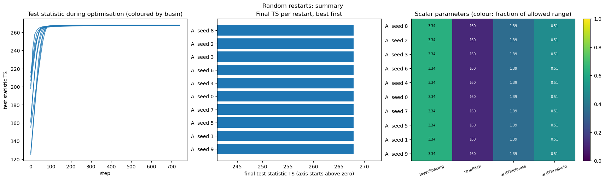
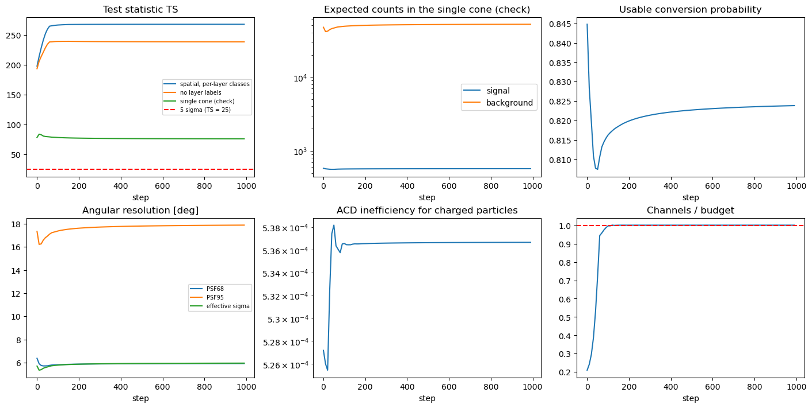

# AutoDetOpt

<p align="center">
  
</p>

> **Status: work in progress.** This project uses automatic differentiation (JAX) to optimise the parameters of a
> gamma-ray pair-conversion tracker, in particular the distribution and amount of tungsten foil. It is at an early
> stage: the detector size and some other inputs are placeholders and the thickest foil sits at a placeholder bound, so no
> design conclusion should be drawn yet. See [FINDINGS.md](FINDINGS.md) for what has been learnt so far and [ROADMAP.md](ROADMAP.md) for
> what is planned.

**How much tungsten, and where?** A pair-conversion tracker needs material to convert the photons, but the same material
scatters the electron and positron and blurs the direction. Fermi-LAT balances this with 16 tungsten layers, thin in front and
thick at the back. HERD's fibre tracker has none ([Fariña et al. 2021](https://doi.org/10.22323/1.395.0651)). Here the
whole detector response is a smooth, differentiable [JAX](https://github.com/jax-ml/jax) function of the design, so the
gradient of the Fermi-style test statistic with respect to every parameter comes for free and Adam climbs it, in the spirit of
the end-to-end optimisation programme of the MODE collaboration ([white paper](https://arxiv.org/abs/2203.13818)).

## At a glance

| | |
|---|---|
| **Figure of merit** | The expected test statistic `TS = 2 ln(L(s+b) / L(b))` of a point source, as in Fermi-LAT (`TS = 25` is 5 sigma), integrated over the sky around the source |
| **Source** | Power law, index 2, 100 MeV to 10 GeV, 8 energy bins (4 per decade), over a diffuse photon and a charged-particle background |
| **Free parameters** | Tungsten thickness of each layer, layer spacing, strip pitch, ACD thickness and threshold |
| **Reconstruction** | A Kalman filter over the hits below the conversion vertex, with scattering, energy loss and the energy sharing of the pair, so the PSF has tails |
| **Optimiser** | Adam on the gradient from `jax.grad`, in an unbounded space mapped to the allowed ranges by a sigmoid |
| **Result so far** | Ten random restarts end in one design: foil thickness rising smoothly from 0.30 mm in the top layer to 2 mm in the last conversion layer. TS 268 (Z = 16) for a source of 1e-7 /cm2 s seen for a year, PSF68 5.9 degrees, PSF95 17.9 degrees |
| **Honest caveats** | The thickest foil is at the 0.2 cm placeholder bound, and the detector size (40 cm) is a placeholder. Fluxes and exposure come from LAT numbers (the charged flux is inferred). The reconstruction is ideal (no hit inefficiency, no pattern recognition). The optimised PSF is 1.6 to 2.5 times wider than the LAT requirement: the optimiser trades sharpness for photons |

## Ten random restarts, one design

Each row is a random starting design that the optimiser improved. The columns are the tungsten thickness of the layers from the
top (0) to the bottom (9). All ten rows reach the same profile. Layers 8 and 9 cannot be a conversion layer, because a track needs
three hits, so they end bare.

<p align="center">
  
</p>

<p align="center">
  
</p>

This was not always so. With an earlier heuristic for the PSF the optimum changed shape with every model improvement (back-loaded,
front-loaded, one foil in every third layer) and random restarts ended in seven different designs. Replacing it with the Kalman
filter removed all of that, so the heuristic was the root cause. The whole story, including the artifacts found on the way, is in
[FINDINGS.md](FINDINGS.md).

<details>
<summary>Optimisation diagnostics (click to open)</summary>

<p align="center">
  
</p>

</details>

## How it works

1. **Layers.** A stack of 10 layers, each a tungsten foil plus 0.014 radiation lengths of passive material (the LAT tracker value),
   with x and y silicon strip planes, inside a plastic scintillator ACD. Photons are absorbed and converted as they go down.
2. **Pseudo-detectors.** Each conversion layer in each energy bin is its own class with its own PSF and background, as the event
   types of Fermi-LAT are. The test statistics add up over layers and energy bins.
3. **PSF.** A backward Kalman filter over the hits gives the direction error of each track. The track scatters (Highland), loses energy
   by radiation, and the pair shares the photon energy as in the Bethe-Heitler distribution. The photon direction is the average of
   the two tracks, as in the HERD reconstruction.
4. **ACD.** A smooth veto efficiency, a self-veto cost for a thick ACD, and a dead-time cost for a low threshold. Charged particles
   that pass it are not rejected again.
5. **Likelihood.** The expected (Asimov) likelihood ratio is integrated over the sky with the exact solid angle of the field of view.
6. **Checks.** The Kalman covariance is checked against an independent least-squares calculation, the spatial integral against
   its analytic limit, and the autodiff gradient against finite differences.
7. **Every number has a source:** a physical constant, a link (see `v0/trackerUtils.py`), or the word "Placeholder".

## Quick start

```bash
git clone https://github.com/lfarinaa/AutoDetOpt.git
cd AutoDetOpt
pip install -r requirements.txt
nbstripout --install            # once: keeps the notebook outputs out of the commits
jupyter lab v0/trackerOptimisation.ipynb
```

The whole notebook, with its ten random restarts, takes about 25 minutes on a laptop-class CPU (the machine it was developed
on). The optimisation of a single design takes about 2 minutes.

## What is where

| | |
|---|---|
| [`v0/trackerOptimisation.ipynb`](v0/trackerOptimisation.ipynb) | The notebook: optimisation, checks, plots, design views, restarts |
| [`v0/trackerUtils.py`](v0/trackerUtils.py) | All formulas and the fixed inputs, each with its source |
| [`v0/designReport.txt`](v0/designReport.txt) | A text report of the initial and the optimised design |
| [`FINDINGS.md`](FINDINGS.md) | A running log of what the optimisation has told us, artifacts included |
| [`PARAMETERS.md`](PARAMETERS.md) | What every input stands for, its reference value and the open decisions |
| [`ROADMAP.md`](ROADMAP.md) | What is planned |
| [`references/`](references) | The bibliography (BibTeX). The papers themselves are not versioned |
| [`tools/exportFigures.py`](tools/exportFigures.py) | Exports the figures above from an executed notebook |
| [`v1/`](v1) | Placeholder for the stochastic, event-level version |

## Projects

The repository holds two separate projects that share a goal but not code:

| Project | Approach | Status |
|---|---|---|
| [`v0/`](v0) | Closed-form expectation, no events | Working notebook |
| [`v1/`](v1) | Stochastic, event-level simulation | Not started |

Each is refined on its own. Neither imports from the other.

---

## trackerOptimisation v0: the numeric toy model

Notebook: [`v0/trackerOptimisation.ipynb`](v0/trackerOptimisation.ipynb) (JAX, optax, matplotlib).
All formulas and the fixed inputs are in [`v0/trackerUtils.py`](v0/trackerUtils.py), which the notebook imports.
The notebook keeps the optimisation loop, the checks, the plots, the design views and the text report
(`v0/designReport.txt`).

**Free parameters:** converter thickness per layer, layer spacing, strip pitch, ACD thickness, ACD threshold.
**Fixed:** layer count (scanned by hand), the source spectrum, detector size, fluxes, exposure.
**Objective:** the expected test statistic of a point source over diffuse photon and charged-particle backgrounds, with smooth
penalties for the channel budget and the height. See "How it works" above, and the decisions below.

All numbers are placeholders. Do not trust an optimum until they are set to realistic values.

### Design decisions for v0

- **Single objective.** v0 optimises one figure of merit. There is no multi-objective optimisation and no
  Pareto front here.
- **The figure of merit is a spatial likelihood ratio.** The signal-cone count (fixed 2 sigma radius) is to be
  replaced by the likelihood ratio of the data with and without a point source. In the expected (Asimov)
  limit this is a spatial integral over the sky around the source:
  `Z^2 = integral of 2 [(s + b) ln(1 + s/b) - s] dA`, with `s(r)` the signal density (flux times PSF) and `b`
  the background density. This is how Fermi-LAT sensitivities are computed (median TS = 25 for 5 sigma, at
  least 10 photons), and what the HERD ICRC 2021 sensitivity does through the Fermi tools.
- **The objective is the test statistic.** Following Fermi-LAT, the figure of merit is the expected test statistic
  `TS = 2 ln(L(signal + background) / L(background))`, which is `Z^2` of the spatial integral, and the optimiser
  maximises `ln TS`. A 5 sigma detection is `TS = 25`. This has the same optimum as the old significance `Z`
  (the penalty weight is doubled to compensate), and the old loss is kept as `computeLossFromSignificance`.
- **Each conversion layer is its own pseudo-detector.** Photons are classified by conversion layer, as in
  Fermi-LAT event types (PSF0-3). Class `l` has its own signal `S * p_l`, its own PSF (from the per-layer
  angular variance) and its own background `b_l`. The objective is the sum over classes of the spatial
  integral above. The converter amount and distribution then change the core and tails of each class
  separately, and no class is diluted by the others.
- **Confusion matrix, identity by default.** The model has a matrix `C[l', l]`, the probability of assigning
  layer `l'` to a photon that truly converted in layer `l`. v0 uses the identity (perfect labels), which is
  the trivial case and an upper bound. Rows that are all identical give no labels, which collapses to a
  single mixture PSF and is a lower bound. A realistic matrix will come from the track-reconstruction model.
- **Passive material is explicit.** Each layer has `passiveRadiationLengthsPerLayer = 0.014` X0 of material that is
  not the foil (silicon detectors, supports and electronics; the LAT tracker has 0.014 X0 per x-y plane, Table 2). The
  photon is absorbed by it and can convert in it, and the pair scatters in it: a layer is treated as one slab of foil
  plus passive material. A layer with no foil is therefore never empty, and the lower bound of the foil thickness is
  exactly 0. This replaces the earlier floor of `1e-3 cm` of tungsten, which stood in for the passive conversion. LAT
  reports PSF tails from conversions in support material. Here those photons share the Gaussian PSF of their layer, so the
  tails are not modelled yet.
- **Background per class.** The diffuse photon background follows the conversion probabilities. The
  charged-particle background that gets through the ACD is final: nothing rejects it afterwards (decided). It is
  a minimum-ionising particle crossing the whole instrument, so the foils neither attenuate it nor change its
  total rate. Which class it falls in is an assumption (no source): it fakes a conversion by interacting in the
  material of a layer (delta rays, bremsstrahlung, hadronic), so its share follows the radiation lengths of each
  layer (foil and silicon), not the conversion probability.
  **History of this choice:** (1) all in layer 0 with perfect labels gave a free perfect veto, and the optimiser
  abandoned the ACD. (2) Spread like the photons made it behave like a gamma in the tracker (attenuated,
  tied to the pair-conversion coefficient) and like a proton in the ACD. (3) An even split over the classes was
  exploitable: with all the signal in one class, perfect labels removed 7/8 of the charged background for free
  (labelled TS 30 against 16 without labels). The material-proportional share removes these loopholes: the
  labelled, no-label and single-cone numbers rise together (TS 598, 513 and 347 at the optimum).
- **Reconstructable layers only.** A track needs `hitsRequiredForTracking = 3` hits: the conversion layer and the
  two layers below (HERD: at least 3 hits per particle; LAT: the first 2 planes after the conversion must be
  measured). So the last `minimumDownstreamLayersForReconstruction = 2` layers cannot be a conversion layer,
  and there are `numberOfLayers - 2 = 8` classes. This is a fixed mask, not an empty class.
- **PSF model: a Kalman filter (the default), with the earlier window heuristic kept.** The direction of each pair member
  comes from a backward Kalman filter over all the hits below the conversion vertex. The state is the position and the
  slope at a plane, the hit error is `pitch/sqrt(12)`, and the multiple scattering of each layer is process noise on the
  slope (Highland with the log term applied once to the whole track material, as PDG advises). The track loses energy by
  radiation, `E(t) = E exp(-t)`, so the scattering grows along it. The covariance does not depend on the hit values, so it
  is a deterministic recursion with no simulated events. It is checked against an independent generalised-least-squares
  calculation (1e-5 relative) and the closed form without scattering. The energy sharing of the pair,
  `1 - 4/3 x(1-x)` (PDG Eq. 34.31), is integrated over 6 nodes between a minimum track energy (placeholder 10 MeV) and
  its complement, so the PSF of each layer is a mixture of Gaussians with natural tails, and the cut gives a signal
  efficiency (0.81 in the lowest energy bin). The photon direction is the plain average of the two tracks, as in the HERD
  reconstruction, plus the intrinsic opening angle. Still idealised: ideal hit efficiency, no pattern recognition,
  Gaussian scattering, no vertex constraint. `setPsfModel("window")` restores the earlier heuristic (one combined
  scatterer, the two layers with the fitted hits at full weight, a toy weight of 1/3 below), which reproduces its old
  numbers exactly. That heuristic produced a comb-shaped optimum and many local optima that the Kalman model does not
  (see [FINDINGS.md](FINDINGS.md)).

### Power-law source and energy bounds

The monoenergetic photon is replaced by a power law, `dN/dE ~ E^-Gamma`, truncated at both ends:
`E_min <= E <= E_max`, and zero outside. `Gamma = 2` as in the Fermi-LAT and HERD sensitivity definitions.
The diffuse photon and charged-particle backgrounds get their own spectral indices. All values below are
placeholders. The reasoning is recorded here so the bounds are not changed without checking it.

**Lower bound `E_min`: Compton domination.**
- The model is a pair-conversion model. Where Compton scattering dominates over pair production, the
  conversion probability, the PSF and the track reconstruction do not describe the events. Compton needs its
  own reconstruction, which is v1 territory.
- The Compton and pair cross sections cross at about 10 MeV in tungsten and at a higher energy in silicon
  (from memory, check against NIST XCOM). `E_min` must sit above the crossover for every material that acts
  as a converter.
- Starting value `E_min = 100 MeV`: above the crossover with margin. The `7/9` conversion coefficient is the
  high-energy limit, and PDG (Eq. 34.32) says it is accurate to a few percent only down to about 1 GeV. So it
  is optimistic at `E_min`, and the shortfall should be quantified with tabulated cross sections.

**Upper bound `E_max`: shower containment, statistics and backsplash.**
1. *Shower containment (pair-track validity).* The model assumes two tracks from a clean pair. At high
   energy the pair radiates and the secondaries shower inside the dense foil stack, so hits no longer belong
   to two tracks. The shower maximum is at `t_max ~ ln(E / E_c) + 0.5` radiation lengths for a photon, with
   `E_c` the critical energy of the converter (7.97 MeV for e- in tungsten, PDG [pdg2024tungsten]). Placeholder rule: the total
   material of the tracker, `X_tot` in radiation lengths, should not exceed `t_max(E_max)`. For
   `E_max = 10 GeV` that is about 7.6 radiation lengths. Must be validated with a full simulation.
2. *Particle flux and statistics.* For `Gamma = 2` the expected signal counts above `E` fall as `1/E`.
   Beyond the energy where fewer than about 10 signal photons are expected above `E_max`, higher energies
   add nothing to the sensitivity (the minimum-photon criterion of the Fermi definition).
3. *Backsplash and self-veto.* Shower particles leaking back into the ACD veto real photons, and the effect
   grows with energy (the reason the Fermi-LAT ACD is segmented, from memory). Not modelled in v0, but it
   sets a practical upper limit and is one of the missing trade-offs that stop ACD thickness running to its
   bound.
- Starting value `E_max = 10 GeV`.

**Implementation (the notebook uses the power law).** `sourceType = "powerLaw"` in `v0/trackerUtils.py` builds
`numberOfEnergyBins = 8` logarithmic bins between `E_min` and `E_max`, 4 per decade as in the HERD proceedings. The
energy is known perfectly (no migration), so each bin is its own set of conversion-layer classes. For each bin the
model takes the share of each integral flux that falls in it, the PSF at the signal-weighted mean of `1/E^2` over the
bin, and the sum over bins and layers of the spatial TS is the objective. In the Asimov dataset the best-fit power
law is the true one, so this sum is the TS of the signal power-law fit against the background-only fit, as in
Fermi-LAT. The diffuse (index 2.1, from the LAT paper) and charged (index 2.7, placeholder) backgrounds have their own
spectra. The old monochromatic source is kept with `setSourceType("monochromatic")`, and it reproduces the previous
numbers exactly (initial design: TS 229.8, no-label 210.3, cone 160.4). The three bound warnings are in
`computeBoundWarnings` and are printed in the design report.

**Flux normalisation (decided).** Each flux is the integral flux above `E_min`, so the existing numbers keep
their meaning. The truncation at `E_max` then removes a small part of the stated flux, which is accounted for
in the counts.

**Warnings, not penalties.** The bounds are checked and reported, but they do not enter the loss. That keeps
the gradients clean and keeps violations visible. Warnings go to stderr in the script, and are checked at
every recorded step and for the final design:
- `E_min` is below the Compton and pair crossover of a converter material.
- The tracker is too large for the upper bound: `X_tot > t_max(E_max)`. The optimiser can trigger this by
  growing converter thickness, and the layer count (scanned by hand) can trigger it too.
- More than about 10 expected signal photons above `E_max`: the truncation discards signal.

**What the model needs.**
- *Energy-dependent physics.* Pair cross section from tables, multiple scattering `~ 1/E`, opening angle
  `~ m_e / E`. The PSF then depends on energy as well as conversion layer.
- *Energy bins.* Log-spaced bins, 4 per decade as in the HERD ICRC 2021 sensitivity. `Z^2` sums over layer
  classes and energy bins.
- *Assumption: energy is known.* There is no calorimeter in v0, so in reality the energy of a photon is not
  measured by the tracker. For simplicity the default ignores this: energy bins are treated as independent
  classes with perfect energy assignment, which is optimistic. Not considering energy confusion also means
  the calorimeter design is out of scope for v0.
- *To do: energy confusion and calorimeter design.* The structure is the same as for the conversion layer. An
  energy-assignment matrix, with the identity as the trivial case (the current default), would model the
  energy resolution and misassignment. The no-energy limit is the flux-weighted mixture PSF over the
  spectrum. A calorimeter would set the matrix, so its design is a later step.
- **No cone radius parameter.** The cone radius disappears with the integral, so it is not a free or fixed
  input. PSF68 and PSF95 are reported as outputs, to compare with published curves.
- **Motivation.** HERD dropped tungsten foils in the tracker because they degraded the PSF, especially for
  resolving close point sources. v0 is meant to find the optimum amount and distribution of converter.

### Known limitations of v0

- **Pair conversion only.** No Compton or photoelectric interactions, so the energy range starts at 100 MeV. No bremsstrahlung
  photons or showers: the pair loses energy on average, and nothing more.
- **Normal incidence.** No directions, so no side entry, no acceptance, no ACD hermeticity or gaps. That is also why the tracker
  gives the charged background no further rejection.
- **The reconstruction is ideal.** The Kalman filter is a Cramér-Rao-type bound: ideal hit efficiency, no pattern recognition, Gaussian
  scattering, no vertex constraint. The PSF is optimistic.
- **The energy is known perfectly.** There is no calorimeter and no energy migration.
- **Expectations, not events.** The response is an analytic expectation. Event-level effects are for v1.
- **Placeholders at their bounds.** The two thickest foils (0.2 cm), the layer spacing (the 30 cm height) and the ACD (3 cm) are at
  placeholder bounds, so the optimum is partly bound-limited. The fluxes, the exposure and the instrument size are placeholders.

v0 is refined step by step (see [ROADMAP.md](ROADMAP.md)). It stays deterministic.

---

## trackerOptimisation v1: the stochastic, multi-everything workflow

Directory: [`v1/`](v1). Not started. This README section records the design thinking.

Goal: go from the averaged toy to a **multi-particle, multi-direction, multi-interaction** workflow with
reconstruction in the loop.

### What changes relative to v0

| Extension | What is needed |
|---|---|
| **Multiple directions** | Path length `1/cos(theta)`. Lateral leakage and side entry through the finite box, ACD side panels that are actually hit. PSF depends on theta (projected lever arm, scattering path). Separate x and y planes. Acceptance integrated over the field of view and pointing profile. |
| **Multiple particles** | Gamma, e+-, protons, albedo gammas, neutrons, each with a flux spectrum and interaction model, and its own pass through veto and tracker. Backgrounds depend on the design through the tracker (dE/dx, topology), not only the ACD. |
| **Multiple interactions** | Compton, photoelectric, bremsstrahlung, ionisation, delta rays, hadronic secondaries. Cross-section tables (NIST XCOM) as differentiable functions of energy, Z and thickness. Compton dominates below about 10 MeV and needs its own reconstruction. Backsplash gives the real ACD trade-off. |
| **Energy** | Energy as a variable with a spectrum and a binned likelihood. Without a calorimeter, energy comes from track scattering or Compton kinematics, a design-dependent resolution. |

### The central problem: gradients through discrete randomness

In v0 the response is an expectation, so gradients are trivial. With simulated events, outcomes such as
"which interaction", "did the strip fire", "did the track reconstruct" are discrete, and their gradients are
zero or biased. Options, roughly in the order to try them:

1. **Semi-analytic quadrature** over (E, theta, species, depth). Deterministic, exact gradient, fine while
   the dimension is low.
2. **Pathwise (reparametrised) sampling.** Free paths by inverse CDF `s = -ln(u)/mu`, scattering angles from
   Highland or Moliere, energy sharing from Bethe-Heitler. Differentiable in thickness and spacing. Use
   common random numbers so the loss is deterministic for a fixed batch.
3. **Score-function or stochastic-AD estimators** for discrete branches (interaction choice, veto firing).
   Higher variance. Gumbel-softmax relaxations are an option if the bias is acceptable.
4. **Surrogates.** Train a network or generative model on Geant4 across design points and differentiate
   through it (local generative surrogates, Shirobokov et al. 2020).
5. **Differentiate the real simulator.** Aehle et al. (2024) did pathwise derivatives of an EM shower
   simulation. Works but is heavy engineering.

**Geometry.** Moving a boundary changes which events cross it, and naive pathwise gradients with hard
geometry miss that term. Keeping interactions as attenuation integrals (`mu * L`) avoids it. Full ray tracing
needs smooth boundaries or an SDF-style approach, as in differentiable rendering.

### Reconstruction in the loop

- **Pair tracking:** differentiable least-squares or Kalman fit, or a Gluckstern/Billoir-style covariance.
  The Cramer-Rao bound gives a differentiable resolution with the full multiple-scattering covariance.
  Pattern recognition efficiency still needs a soft model.
- **Compton:** ordering and ring reconstruction are combinatorial. Bound with Fisher information, or co-train
  a learned reconstruction with the design (a central MODE theme; TomOpt is their worked example).

### Objective and constraints

- Replace the single cone count with a binned Poisson likelihood in (energy, angle, species). The Asimov
  significance becomes a sum over bins, or use the Fisher information of the source parameters.
- Realistic PSF with tails instead of a fixed 2 sigma cone.
- Cost, mass and power terms, and likely a Pareto front.
- Discrete choices (layer count, material) as outer scans or soft masks.

### Validation

Gradients can be correct for a wrong model. At each stage, validate the optimum against Geant4 (or a similar
full simulation), at the optimised design and at a few perturbed points.

### References (the first was checked, the others are from memory: verify before citing)

- T. Dorigo, A. Giammanco, P. Vischia et al., "Toward the End-to-End Optimization of Particle Physics Instruments with
  Differentiable Programming: a White Paper", [arXiv:2203.13818](https://arxiv.org/abs/2203.13818).
- TomOpt, differentiable muon tomography optimisation.
- Shirobokov et al., "Black-box optimization with local generative surrogates" (2020).
- Aehle et al., pathwise derivatives of electromagnetic shower simulations (2024).

---

## Findings

[FINDINGS.md](FINDINGS.md) is a running log of what the optimisation has told us, including the artifacts we found
and the fact that the shape of the optimum has changed qualitatively with each model improvement. v0 is at an early
stage and no conclusion about where the tungsten should go can be drawn yet.

## References

The papers and web pages used for the numbers are listed in a BibTeX bibliography,
[references/bibliography.bib](references/bibliography.bib), with their DOI or link. The local copies are not versioned
because they are third-party material. Every number in the fixed inputs of `v0/trackerUtils.py` is followed by a comment
with its source (a physical constant, a link, or "Placeholder").

## Parameters

Every input stands for real physical quantities. [PARAMETERS.md](PARAMETERS.md) ties each one to its meaning
and to reference values from the Fermi-LAT instrument paper and the HERD proceedings, and lists the decisions
needed before the values are applied.

## Working on the notebook

Notebook outputs (the figures are most of its size) are stripped from the commits with
[nbstripout](https://github.com/kynan/nbstripout), so the repository stores only the notebook's source. Your working copy
keeps its outputs. After cloning, run `pip install nbstripout` and `nbstripout --install` once in the repository to switch the
filter on (`.gitattributes` already names the notebooks). The results are kept in text in [FINDINGS.md](FINDINGS.md) and
`v0/designReport.txt`.

## Planned tooling

Both projects are to become command-line scripts that read inputs from a text file and print results to the
terminal. See [ROADMAP.md](ROADMAP.md).
